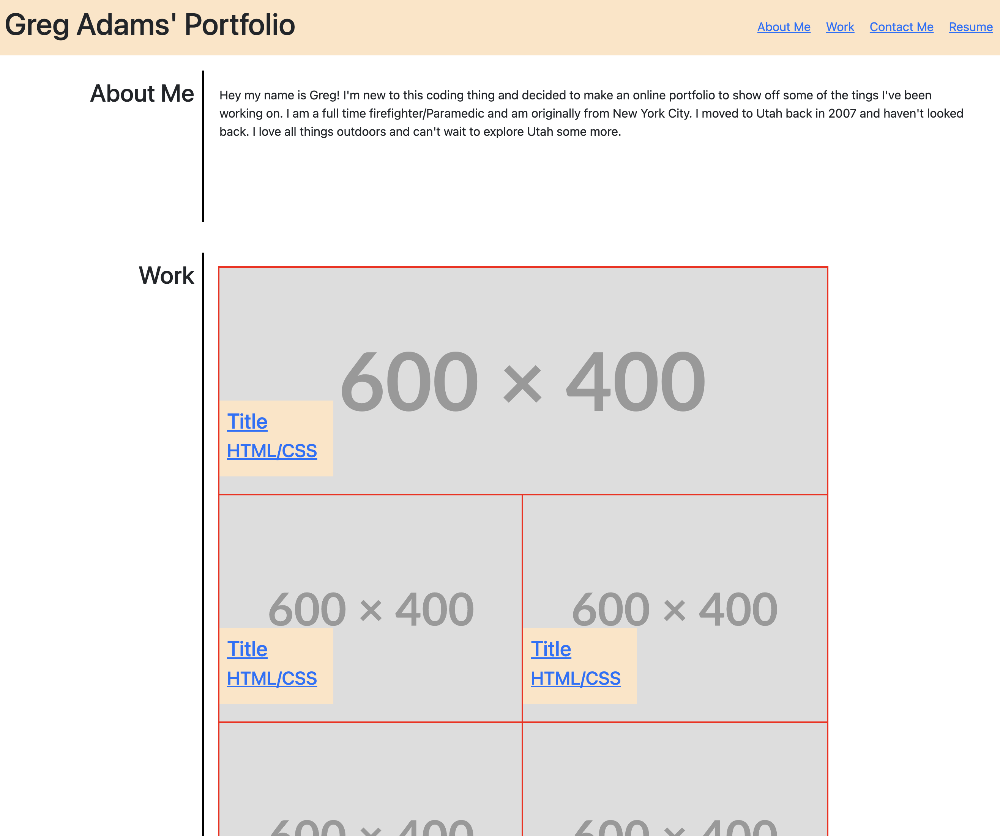

# Profesional Profile

## Description
This was a fun way to display some of my CSS design skills that i've recently learned. I really likesd the freedom of showing off some of my work.

## Screenshots

## Table of Contents
- [Installation](#installation)
- [Usage](#usage)
- [Licesnse](#license)
- [Contributing](#contributing)
- [Questions](#questions)

## Installation
Download or run deployable link.

## License
- MIT
- Link: https://opensource.org/license/mit/   

  

## Contributing
Greg Adam

## Questions
- Github username: gadams45
- Email address: gadams8340@gmail.com
      